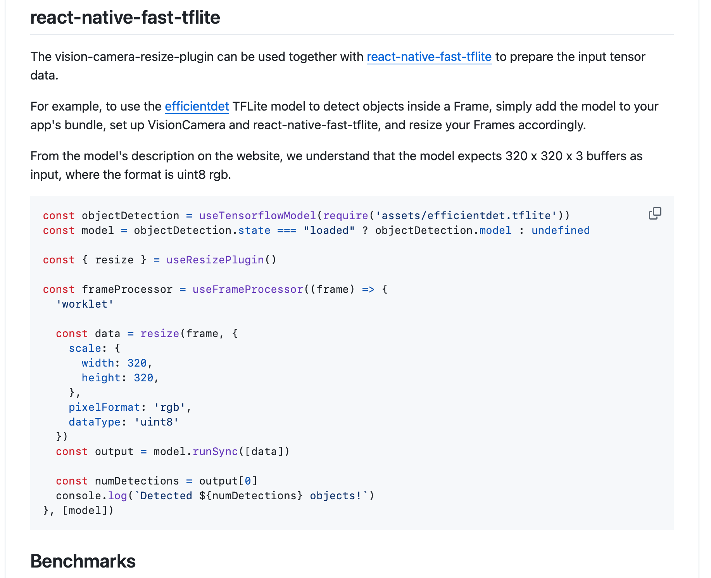
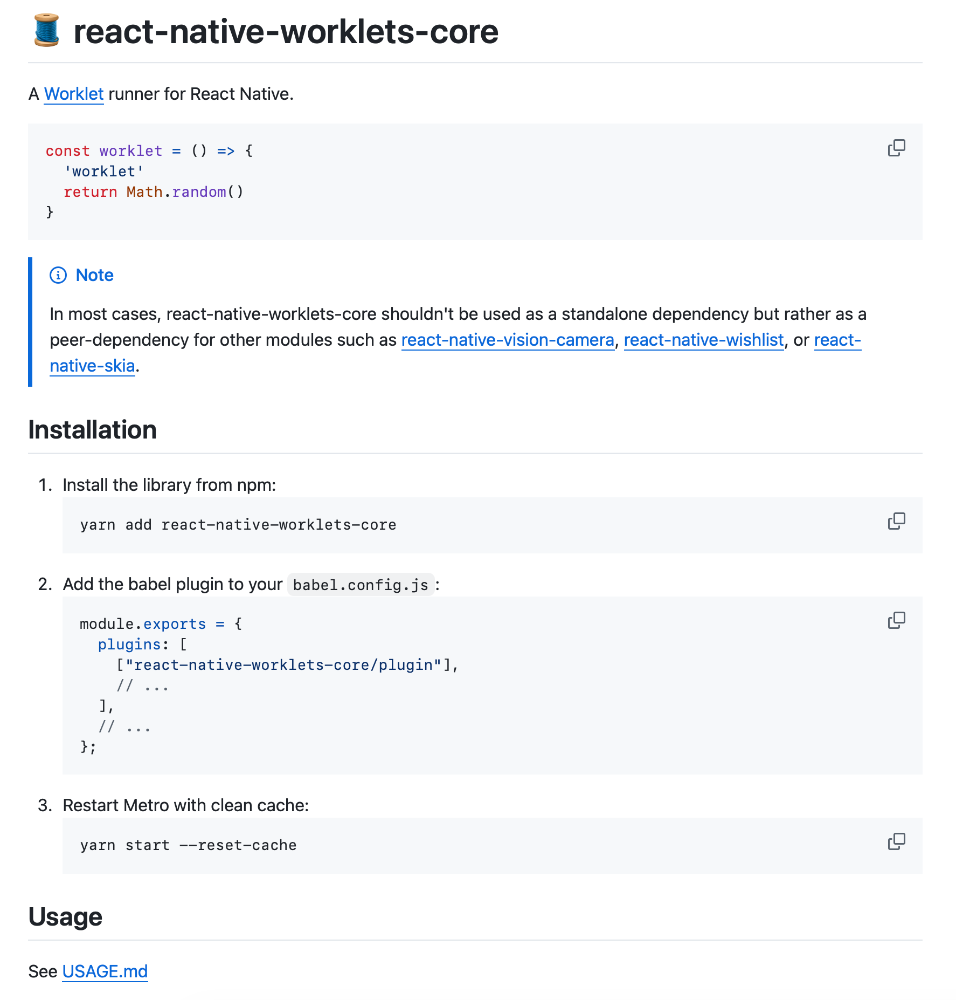

https://react-native-vision-camera.com/docs/guides

## Install package.

`npx expo install react-native-vision-camera`

## Set up permission implementing the plugin.

```typescript

{
  "name": "my app",
  "plugins": [
    [
      "react-native-vision-camera",
      {
        "cameraPermissionText": "$(PRODUCT_NAME) needs access to your Camera.",

        // optionally, if you want to record audio:
        "enableMicrophonePermission": true,
        "microphonePermissionText": "$(PRODUCT_NAME) needs access to your Microphone."
      }
    ]
  ]
}

```

## Criticl Ref - the plugin

https://github.com/mrousavy/vision-camera-resize-plugin


It's dependency:

> 🧵 A library to run JS functions ("Worklets") on separate

https://github.com/margelo/react-native-worklets-core


https://github.com/Shopify/react-native-skia
skia for drawing boxes
https://shopify.github.io/react-native-skia/docs/getting-started/installation/
some usecases:
- https://www.reddit.com/r/reactnative/comments/1cn9y0e/how_are_people_using_skia/