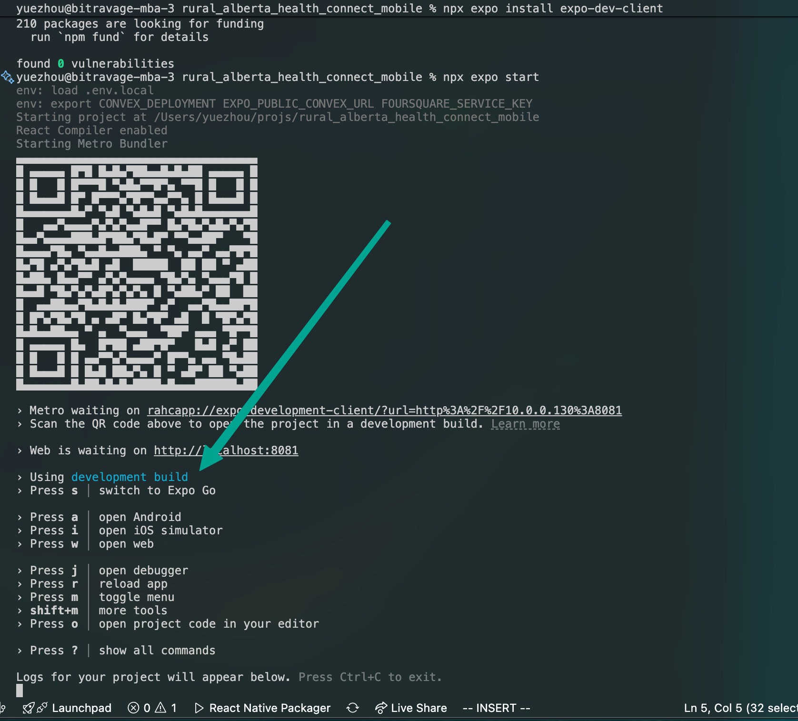
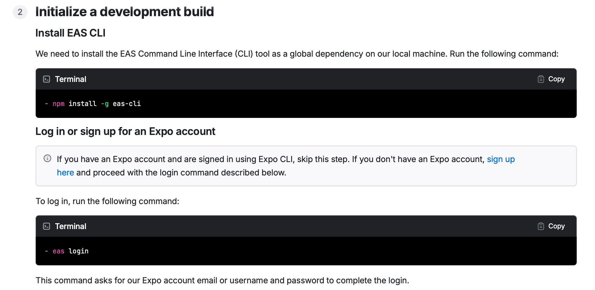
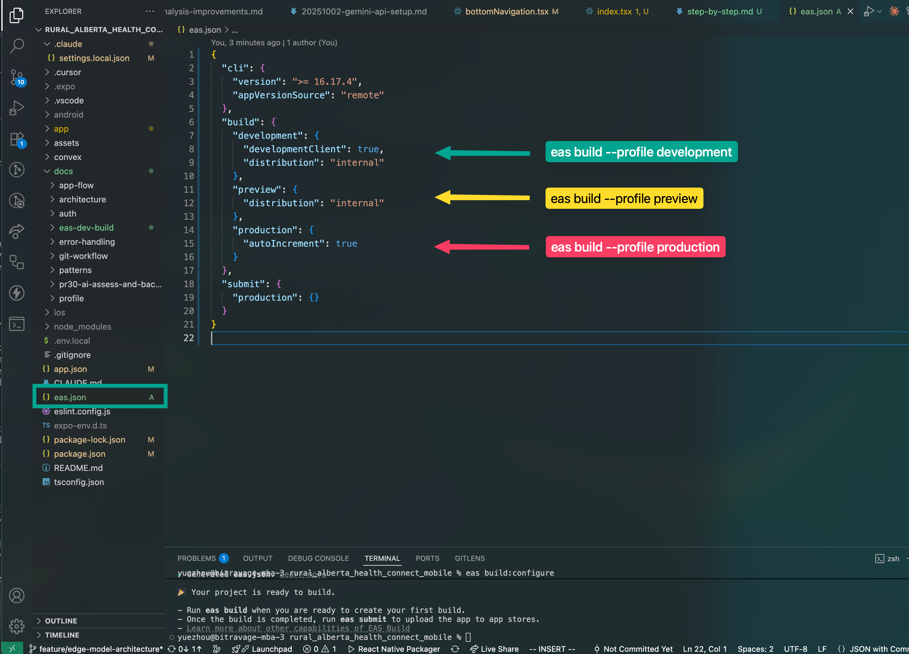

https://www.youtube.com/watch?v=uQCE9zl3dXU
https://docs.expo.dev/tutorial/eas/configure-development-build/

1. `npx expo install expo-dev-client`

   This unlocks dev-client, meaning, we not limited to EXPO GO

   

   But in order for the dev development build to work, we need an actual development build.

2. `npm install -g eas-cli`

   In order to make a development build, we need an EAS CLI, which is a cloud service.

   

3. run `eas init`

   Create an init an eas project on the cloud.

4. run `eas build:configure`

   

5. build `eas build --platform android --profile development`

   https://youtu.be/D612BUtvvl8?t=75

6. Wait 30 min.

