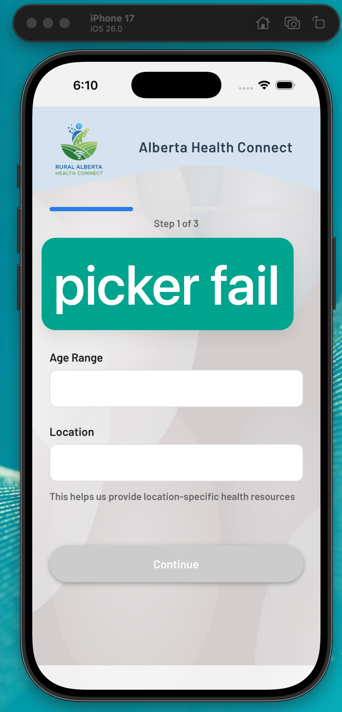

bug find: the picker not working on ios simulator with expo go dev build
Proposed solution: pre-build locally. 
Result: not working.

Propulsed Solution 2: https://www.youtube.com/watch?v=8J1xzy9LCHo
Result: not working.

Proposed solution 3: try real device.
Result: not working.

Proposed solution 4: 
Replace @react-native-picker/picker with native iOS ActionSheetIOS in the personal-info.tsx file
Result: works. and smooth!

