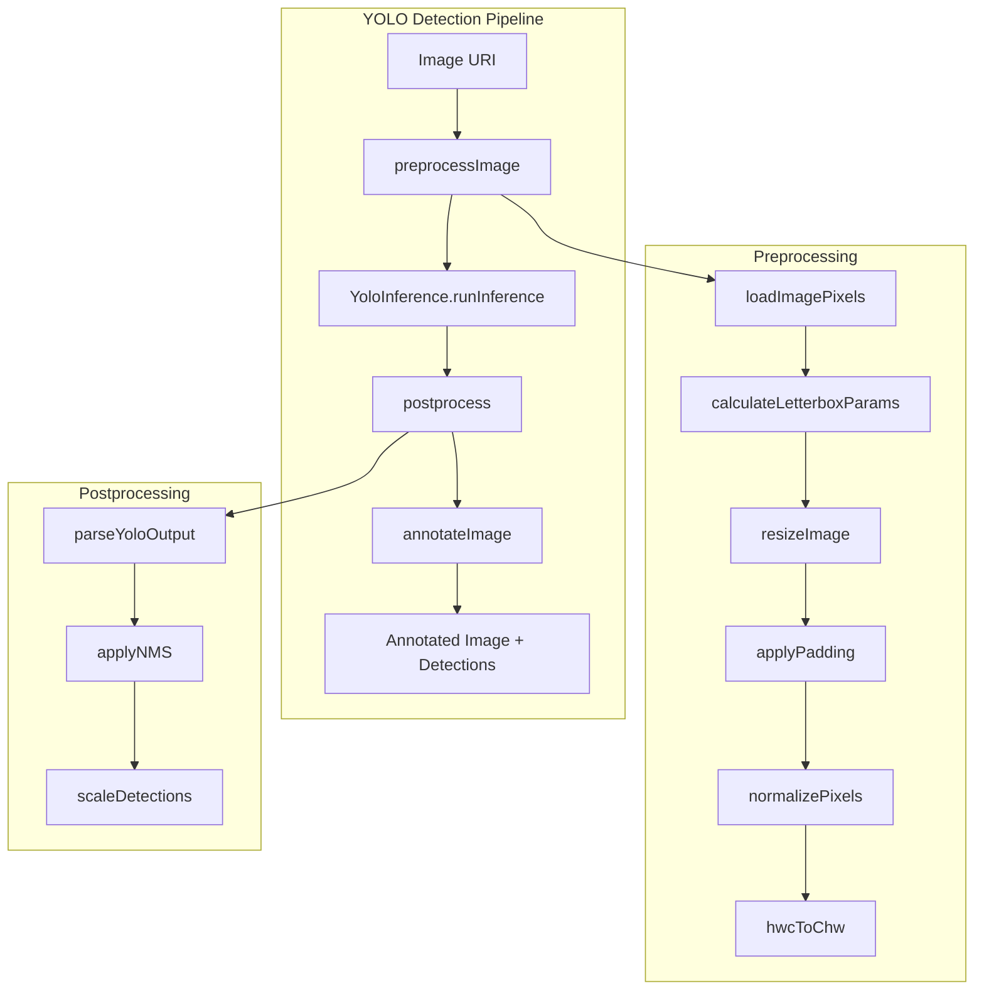
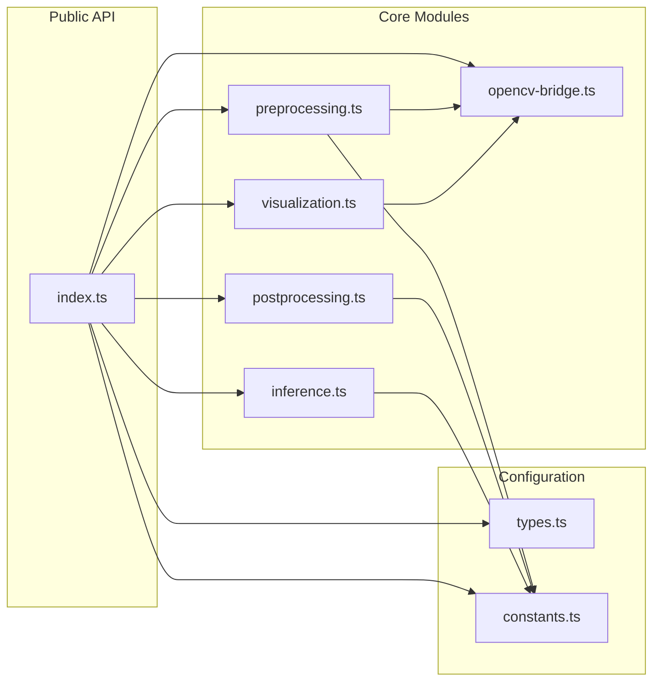
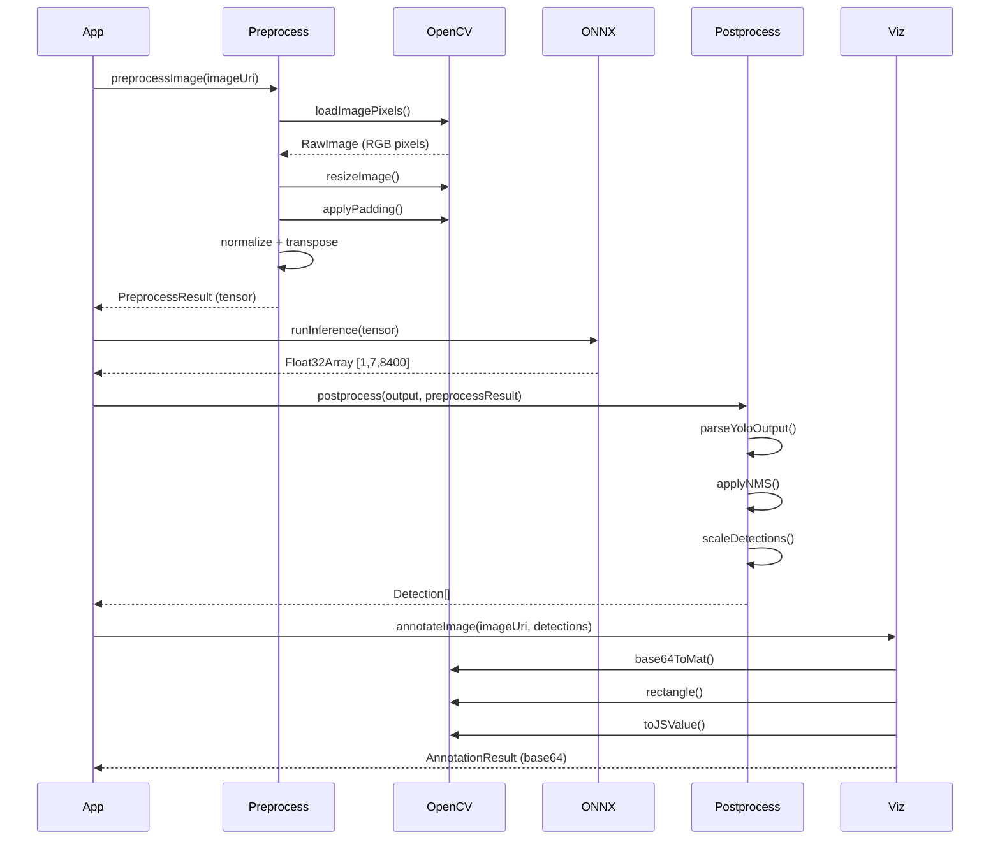

# YOLO Detection Module

A modular, testable YOLO object detection pipeline for React Native with ONNX Runtime.

## Overview

This module provides a complete pipeline for running YOLO object detection on mobile devices:
- **Preprocessing**: Image loading, letterbox resize, normalization
- **Inference**: ONNX Runtime model execution
- **Postprocessing**: Output parsing, NMS, coordinate scaling
- **Visualization**: Bounding box drawing with OpenCV

## Architecture



## Module Structure



## Data Flow



## Installation

### Dependencies

```bash
npm install onnxruntime-react-native react-native-fast-opencv expo-file-system expo-asset
```

### Metro Configuration

Add ONNX to asset extensions in `metro.config.js`:

```javascript
const { getDefaultConfig } = require('expo/metro-config');
const config = getDefaultConfig(__dirname);
config.resolver.assetExts.push('onnx');
module.exports = config;
```

### Required Files

Copy the entire `utils/yolo/` folder to your project and import from the index:

```
utils/yolo/
├── index.ts           # Public API exports
├── types.ts           # TypeScript interfaces
├── constants.ts       # Model configuration
├── preprocessing.ts   # Image preprocessing
├── opencv-bridge.ts   # OpenCV wrapper
├── inference.ts       # ONNX Runtime wrapper
├── postprocessing.ts  # Output parsing + NMS
├── visualization.ts   # Bounding box drawing
└── README.md          # This file
```

## Quick Start

```typescript
import {
  YoloInference,
  preprocessImage,
  postprocess,
  annotateImage,
  MODEL_CONFIG,
} from '@/utils/yolo';

// 1. Initialize and load model
const yolo = new YoloInference();
await yolo.loadModel(modelUri);

// 2. Run detection pipeline
const preprocess = await preprocessImage(imageUri);
const output = await yolo.runInference(preprocess.tensor);
const detections = postprocess(output, preprocess, MODEL_CONFIG);

// 3. Draw bounding boxes (optional)
if (detections.length > 0) {
  const annotated = await annotateImage(imageUri, detections);
  // annotated.base64 contains the image with boxes drawn
}
```

## Configuration

Edit `constants.ts` to match your model:

```typescript
export const MODEL_CONFIG: ModelConfig = {
  inputWidth: 640,           // Model input width
  inputHeight: 640,          // Model input height
  numClasses: 3,             // Number of classes
  classNames: ['abrasion', 'bruise', 'cut'],  // Class labels
  confidenceThreshold: 0.5,  // Min confidence to keep
  iouThreshold: 0.45,        // IoU threshold for NMS
};
```

## API Reference

### Preprocessing

| Function | Description |
|----------|-------------|
| `preprocessImage(uri, targetSize?)` | Full preprocessing pipeline |
| `calculateLetterboxParams(w, h, target)` | Calculate resize/padding params |
| `normalizePixels(pixels)` | Normalize [0-255] → [0-1] |
| `hwcToChw(data, h, w, c)` | Transpose HWC → CHW |

### Inference

| Function | Description |
|----------|-------------|
| `new YoloInference()` | Create inference instance |
| `yolo.loadModel(uri)` | Load ONNX model |
| `yolo.runInference(tensor)` | Run model inference |
| `yolo.isModelLoaded()` | Check if model is loaded |

### Postprocessing

| Function | Description |
|----------|-------------|
| `postprocess(output, preprocess, config)` | Full postprocessing pipeline |
| `parseYoloOutput(output, config)` | Parse raw YOLO output |
| `applyNMS(detections, iouThreshold)` | Non-maximum suppression |
| `scaleDetections(detections, preprocess)` | Scale boxes to original image |
| `calculateIoU(box1, box2)` | Intersection over Union |

### Visualization

| Function | Description |
|----------|-------------|
| `annotateImage(uri, detections)` | Draw boxes on image |
| `getClassColor(className)` | Get BGR color for class |
| `drawBoundingBox(mat, detection)` | Draw single box |

## Type Definitions

```typescript
interface Detection {
  box: BoundingBox;           // {x, y, width, height} center format
  boxCorners: BoundingBoxCorners;  // {x1, y1, x2, y2} corner format
  classId: number;
  className: string;
  confidence: number;
}

interface PreprocessResult {
  tensor: Float32Array;       // [1, 3, 640, 640] flattened
  originalWidth: number;
  originalHeight: number;
  scale: number;              // Letterbox scale factor
  padX: number;               // Horizontal padding
  padY: number;               // Vertical padding
}

interface AnnotationResult {
  base64: string;             // JPEG image with boxes
  width: number;
  height: number;
  detectionsDrawn: number;
  timeMs: number;
}
```

## YOLO Output Format

Expected model output shape: `[1, 7, 8400]`

```
7 features per prediction:
├── [0] x_center
├── [1] y_center
├── [2] width
├── [3] height
├── [4] class_0_probability
├── [5] class_1_probability
└── [6] class_2_probability

8400 predictions from 3 feature maps:
├── 80×80 = 6400 (small objects)
├── 40×40 = 1600 (medium objects)
└── 20×20 = 400  (large objects)
```

Data layout is **row-major**: feature `f` at prediction `i` = `output[f * 8400 + i]`

## Testing

Run built-in unit tests:

```typescript
import { runAllYoloTests, testOpenCVBasic, testOpenCVBridge } from '@/utils/yolo';

// Run all pure function tests (no device needed)
runAllYoloTests();

// Test OpenCV is working
testOpenCVBasic();

// Test full OpenCV pipeline with real image
await testOpenCVBridge(imageUri);
```

## Performance

Typical performance on iPhone 11:

| Stage | Time |
|-------|------|
| Preprocess | ~500ms |
| Inference | ~350-500ms |
| Postprocess | ~10ms |
| Visualization | ~25-35ms |
| **Total** | **~1 second** |

## Class Colors

Visualization uses BGR colors (OpenCV format):

| Class | Color | BGR |
|-------|-------|-----|
| abrasion | Red | [0, 0, 255] |
| bruise | Purple | [255, 0, 128] |
| cut | Green | [0, 255, 0] |
| (unknown) | Yellow | [0, 255, 255] |

## Adapting for Other Models

1. Update `constants.ts` with your model's configuration
2. If output shape differs from `[1, 7, 8400]`, modify `parseYoloOutput()` in `postprocessing.ts`
3. If using different input size, update `MODEL_CONFIG.inputWidth/Height`
4. Add/modify class names and colors as needed

## Troubleshooting

### Model won't load
- Ensure `.onnx` is in Metro's `assetExts`
- For large models (>40MB), use `Asset.downloadAsync()`

### OpenCV errors
- Call `OpenCV.clearBuffers()` after operations
- Ensure image URI is valid file:// path

### Wrong detections
- Check confidence threshold (lower for testing)
- Verify model output shape matches expected `[1, 7, 8400]`
- Ensure preprocessing matches training (letterbox, RGB, normalized)

## License

MIT
